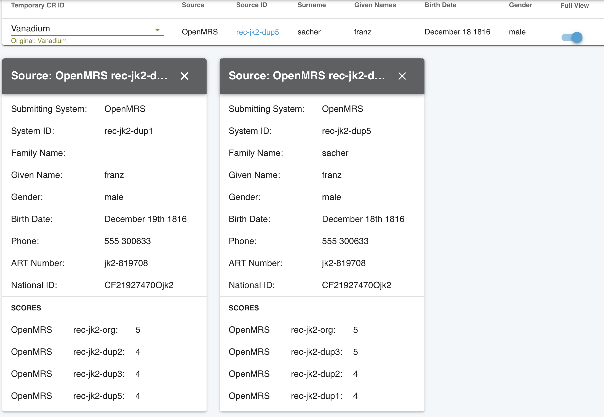

# UI -- Human Adjudication

!!! caution
    You may not have access to the UI, and that's a good thing. The UI allows users to be able to view any break any match, which includes viewing demographic data from submitting systems. It should be secure and only authorized users must be able to access it.

The OpenCR User Interface has advanced features for human adjudication to conduct curate matches and create new ones. This is more advanced than simply breaking and reverting matches.

## Action Required Tab

The home page has an action required tab. On this tab are a list of the flagged records. They may have one of two potential areas of human adjudication.

1. **Potential matches**: These are matches which passed a minimum threshhold but another match was higher.
2. **Conflicts on match**: These matches passed a high threshhold and are very close to the chosen match.
3. **Remove the flag**: This is to remove the action required flag and no action will be taken.

In a column on the right are the reasons for action being required.

Clicking on a record gives you only one set of actions for that record and its related record. Once that record is resolved in some way, through actions 1-3 above, then the next set of records will be loaded. Another way to get to a specific record is to search for it from the main actions required tab.

## Understanding the Menu

## Adjudication

