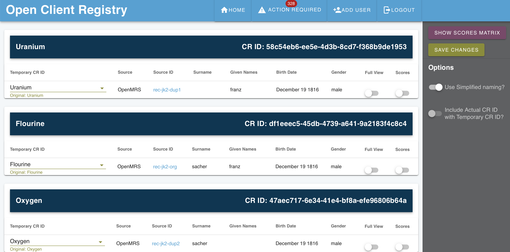
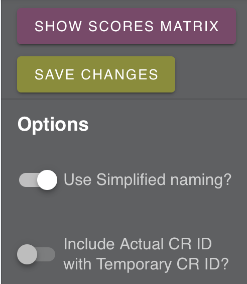
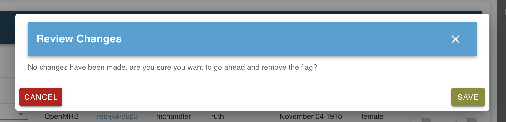
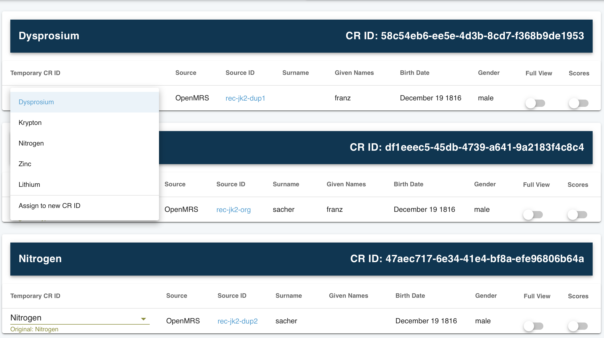
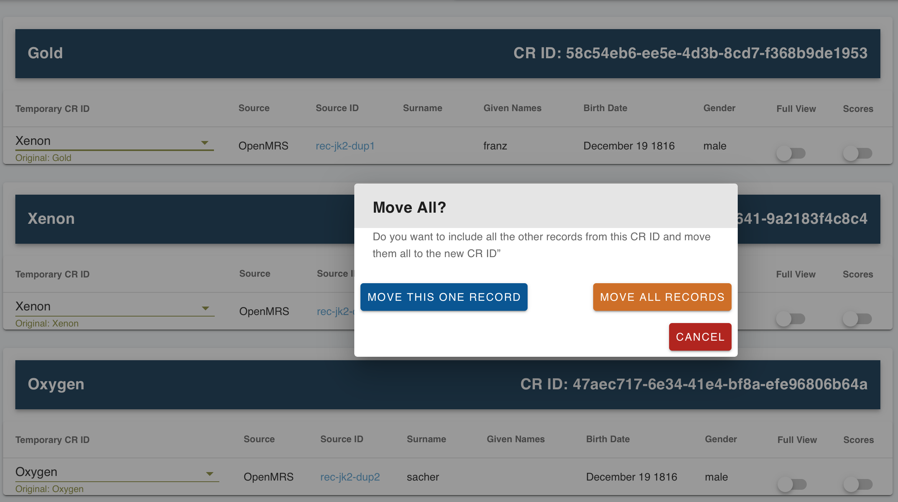

# UI -- Human Adjudication

!!! caution
    You may not have access to the UI, and that's a good thing. The UI allows users to be able to view any break any match, which includes viewing demographic data from submitting systems. It should be secure and only authorized users must be able to access it.

The OpenCR User Interface has advanced features for human adjudication to conduct curate matches and create new ones. This is more advanced than simply breaking and reverting matches.

## Action Required Tab

The home page has an action required tab. On this tab are a list of the flagged records. They may have one of two potential areas of human adjudication.

1. **Potential matches**: These are matches which passed a minimum threshhold but another match was higher.
2. **Conflicts on match**: These matches passed a high threshhold and are very close to the chosen match.
3. **Remove the flag**: This is to remove the action required flag and no action will be taken.

In a column on the right are the reasons for action being required.

Clicking on a record gives you only one set of actions for that record and its related record. Once that record is resolved in some way, through actions 1-3 above, then the next set of records will be loaded. Another way to get to a specific record is to search for it from the main actions required tab.

## Understanding the Actions Tab

The actions page for the set of records shows large dark blue banners under which are each unique linked record in the set. The CRID (unique identifer in OpenCR) assigned is displayed along with more information.

### Options Menu

There is an options menu to the right side. This has several faetures.

**Save changes**: After making all changes, the user must review and accept them. This feature can also be used to remove the flag and move to the next set of records.

**Simplified naming**: The simplified naming option is meant to make the records easier to reference. It uses the names of the elements in the periodic table. The names are only shortcuts to refer to the records instead of the identifiers. On another page the simplified names will be reused, so they are not unique between pages of records, only for each action page for groups of records. This feature can be turned off. The names do not in any reflect matching.

**Show scores matrix**: This shows a 2D matrix of all records against one another to show what the overall decision rules scores were that were the result of matching. When this is selected, a table pops up at the bottom of the page showing the matrix.

**Include actual CRID with temporary ID**: This toggles showing full IDs for the record.

### Views

**Full view**: On each subrecord under the CRID record there is a full view toggle. At the bottom of the page a popup card will show the full record information. This may be helpful in comparing records. If multiple toggles are flipped, then those records will all be revealed.

## Adjudication

After review, in order to move records around into another CRID there is a dropdown menu. This makes it easy to select which records to move. If the record does not exist, then a new CRID can be created.

On selecting an action, there is a confirmation box. Note that the changes are not yet pushed.

## Review Changes or Removing Flags

After making changes to records, the user must review and accept them.

!!! warning
    The user must choose to save changes in the option menu for changes to be made.